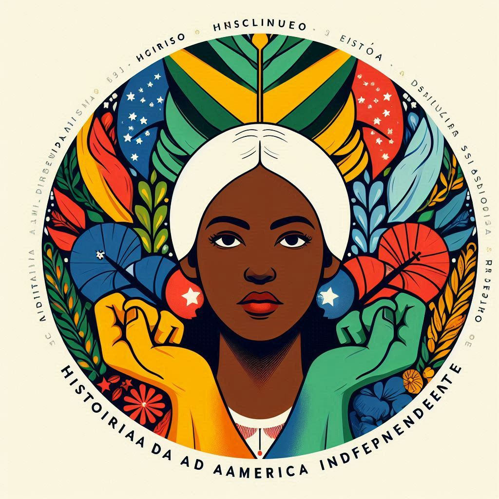

|Tipo | Tema | Pontos | Prazo |Observações|
|--------|----------------------|-----|------------|---------------------|
| Remota | IA e História da América Independente | 1,0 | 21/08/2024 | Atividade individual; entregar texto em sala |

[Clique aqui para baixar a versão em PDF desta atividade.](https://ericbrasil.com.br/cclhm0081/at01.pdf)

# Introdução

Nesta atividade, vamos explorar como modelos de Inteligência Artificial Generativa representam visualmente a disciplina "História da América Independente". Para isso, vamos utilizar dois modelos diferentes: ChatGPT 4o e Copilot (usando DALL-E 3).

A versão do ChatGPT 4o foi utilizado no plano pago da plataforma OpenAI, enquanto o Copilot foi utilizado na versão gratuita no navegador Microsoft Edge.

### Observações

Prompt é uma instrução que é forncecida pelo usuário para a IA. A partir do prompt, a IA gera uma resposta. No caso, o prompt é a instrução para criar uma imagem que represente a disciplina "História da América Independente".

O ChatGPT 4o é o modelo mais recente da OpenAI para geração de texto e imagens. Ele é capaz de gerar respostas mais complexas e detalhadas. Para mais informações, acesse o [site da OpenAI](https://openai.com/).

O Copilot é um modelo de IA desenvolvido pela OpenAI em parceria com a Microsoft. Ele é capaz de gerar código, textos e imagens a partir de prompts fornecidos pelo usuário. Ele está integrado ao Microsoft Edge. Para mais informações, acesse o [site da Microsoft](https://copilot.microsoft.com/).

# Atividade

Leia os prompts, analise as respostas e imagens geradas pelos modelos de IA e comente sobre as representações visuais criadas.

Busque identificar e discutir os seguintes elementos:

1. Quais elementos visuais foram utilizados para representar a disciplina?
2. Como esses elementos se relacionam com o conteúdo da disciplina?
3. Como as imagens representam a disciplina de forma geral?
4. Existem diferenças significativas entre as imagens geradas pelos dois modelos de IA e diferenças a partir dos prompts?

---

## ChatGPT 4o

### Prompt 1

"Crie uma figura colorida 16x9 que represente a disciplina HISTÓRIA DA AMÉRICA INDEPENDENTE, componente obrigatório de um curso de graduação em História. A imagem será apresentada para os discentes para análise e reflexão."

#### Resposta (imagem e texto):

>Aqui está a imagem representando a disciplina "HISTÓRIA DA AMÉRICA INDEPENDENTE". Ela contém elementos simbólicos como o mapa da América Latina, bandeiras de países independentes e figuras históricas importantes como Simón Bolívar, José de San Martín e George Washington, tudo em um estilo que mistura arte histórica com elementos de design moderno. A imagem pode servir como um ótimo ponto de partida para análise e reflexão dos discentes.

### Prompt 2

"agora leia a ementa da disciplina e refaça a imagem:

Ementa: A crise do sistema colonial; Processos de independência e formação dos Estados Nacionais: história e historiografia; A revolução haitiana; Resistência negra, abolicionismos e luta pela cidadania; Povo e revolução na América Central e no Caribe; Populismo, autoritarismo e democracia no século XX; A construção do conceito de “América Latina”. O ensino de história e historiografia da América Latina na escola básica."

#### Resposta (imagem e texto):

>A imagem foi atualizada para refletir a ementa da disciplina "HISTÓRIA DA AMÉRICA INDEPENDENTE". Ela agora inclui elementos simbólicos que representam a crise do sistema colonial, os processos de independência e a formação dos Estados Nacionais, com destaque para a Revolução Haitiana, a resistência negra, abolicionismos e as lutas pela cidadania. Também estão presentes referências às revoluções na América Central e no Caribe, além de temas como populismo, autoritarismo e democracia no século XX, e a construção do conceito de “América Latina”. A imagem combina arte histórica com design moderno para incentivar uma análise profunda e reflexão sobre esses temas.

---

## Copilot (usando DALL-E 3)

### Prompt 1

"Crie uma figura colorida 16x9 que represente a disciplina HISTÓRIA DA AMÉRICA INDEPENDENTE, componente obrigatório de um curso de graduação em História. A imagem será apresentada para os discentes para análise e reflexão."

#### Resposta[^1]:

[^1]: O Copilot gera sempre quatro imagens a partir do prompt fornecido.

### Prompt 2

"agora leia a ementa da disciplina e refaça a imagem:

Ementa: A crise do sistema colonial; Processos de independência e formação dos Estados Nacionais: história e historiografia; A revolução haitiana; Resistência negra, abolicionismos e luta pela cidadania; Povo e revolução na América Central e no Caribe; Populismo, autoritarismo e democracia no século XX; A construção do conceito de “América Latina”. O ensino de história e historiografia da América Latina na escola básica."

#### Resposta:

