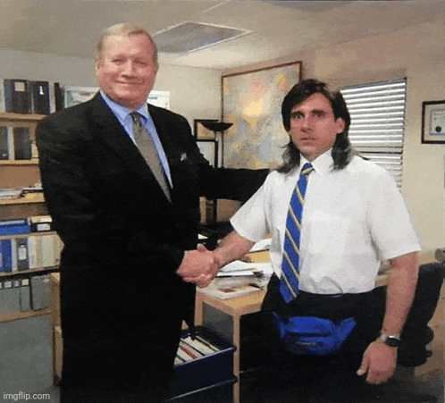

# {.center}

<video autoplay muted loop playsinline aria-label="Vídeo de abertura criado com o Veo3 do Google">
  <source src="assets/abertura.mp4" type="video/mp4">
</video>

---

## Acesse os slides da Aula 1 {.center}

---

## Objetivos da aula {.center}

- Discutir os fundamentos epistemológicos e historiográficos da disciplina
- Apresentar a proposta do semestre e os combinados da disciplina

---

## Apresentação da disciplina (1/2) {.center}

- **Disciplina:** História da América Independente
- **Código:** CCLHM0081
- **Professor:** Eric Brasil

---

## Apresentação da disciplina (2/2) {.center}

- **Período:** 2026.2
- **Horário:** quintas-feiras, das 14h às 17h — sala a definir
- **E-mail:** profericbrasil@unilab.edu.br

---

## Sobre a disciplina {.center}

- Estudo comparado das experiências de liberdade e independência nas Américas
- Ênfase nos processos históricos do século XVIII ao XX
- Foco em sujeitos históricos, lutas e projetos políticos

---

## Tema central (1/2) {.center}

**As lutas por liberdade e independência no continente americano**

- Revolução dos EUA (1776)
- Revolução Haitiana (1791–1804)
- Independências na América Hispânica (século XIX)
- Era das Abolições

---

## Tema central (2/2) {.center}

- Revolução Mexicana (1910)
- Revolução Cubana (1959)

---

## Avaliações (1/2) {.center}

- **AT1 — Análise de fontes:** atividade remota em 08/10/2026 — **2,0 pontos**
- **AT2 — Apresentação de texto em sala:** realizada ao longo do semestre — **1,0 ponto**

---

## Avaliações (2/2) {.center}

- **TR — Trabalho final:** atividade remota em 10/12/2026 — **7,0 pontos**
- A nota final corresponde à soma de **AT1 + AT2 + TR**, totalizando **10,0 pontos**

---

## Organização do semestre {.center}

- **Aulas presenciais:** quintas-feiras, das 14h às 17h
- **Atividades remotas:** 08/10, 12/11 e 10/12/2026
- **Dias não letivos:** 17/09, 15/10 e 22/10/2026

---

## Site da disciplina (1/2) {.center}

- [Página inicial](https://ericbrasil.com.br/cclhm0081/)
- [Ementa](https://ericbrasil.com.br/cclhm0081/ementa/ementa)
- [Cronograma](https://ericbrasil.com.br/cclhm0081/ementa/calendario)

---

## Site da disciplina (2/2) {.center}

- [Slides das aulas](https://ericbrasil.com.br/cclhm0081/#slides-das-aulas)
- [Código-fonte](https://github.com/ericbrasiln/cclhm0081)

---

## Combinado não sai caro! (1/2) {.center}

:::: {.columns}
::: {.column width="50%"}

:::
::: {.column width="50%"}
- **Horário:** início às 14h
- **Presença:** mínimo de 75% para aprovação
:::
::::

---

## Combinado não sai caro! (2/2) {.center}

- **Material de apoio:** slides e textos no site da disciplina e no SIGAA
- **Participação:** leitura e envolvimento nas discussões
- **Convivência:** respeito, empatia e diálogo são essenciais

---

## E as leituras obrigatórias? São obrigatórias, ué {.center}

:::: {.columns}
::: {.column width="50%"}

<video autoplay muted loop playsinline aria-label="Cena usada para introduzir as leituras obrigatórias">
  <source src="assets/leituras.mp4" type="video/mp4">
</video>

:::
::: {.column width="50%"}

- Não tem como fugir: **é um curso de História, e leitura é fundamental**.
- Mais do que ler por ler, nosso foco é a **leitura crítica e reflexiva**.

:::
::::

---

## E a tal da Inteligência Artificial? {.center}

:::: {.columns}
::: {.column width="50%"}
<video autoplay muted loop playsinline aria-label="Vídeo criado com o Veo3 do Google">
  <source src="assets/ia.mp4" type="video/mp4">
</video>
:::
::: {.column width="50%"}
- Pode usar?
- Bom, eu estou usando aqui; então, sim, pode usar.
- Mas como usar? Veja este [material de apoio](https://ericbrasil.com.br/cclhm00114/aulas/aula7).
- [Portaria CNPq nº 2.664, de 6 de março de 2026](https://www.in.gov.br/web/dou/-/portaria-cnpq-n-2.664-de-6-de-marco-de-2026-691779232).
:::
::::

---

## Próxima aula {.center}

**Aula 2 — 20/08/2026**

<h1>Revolução Americana</h1>
