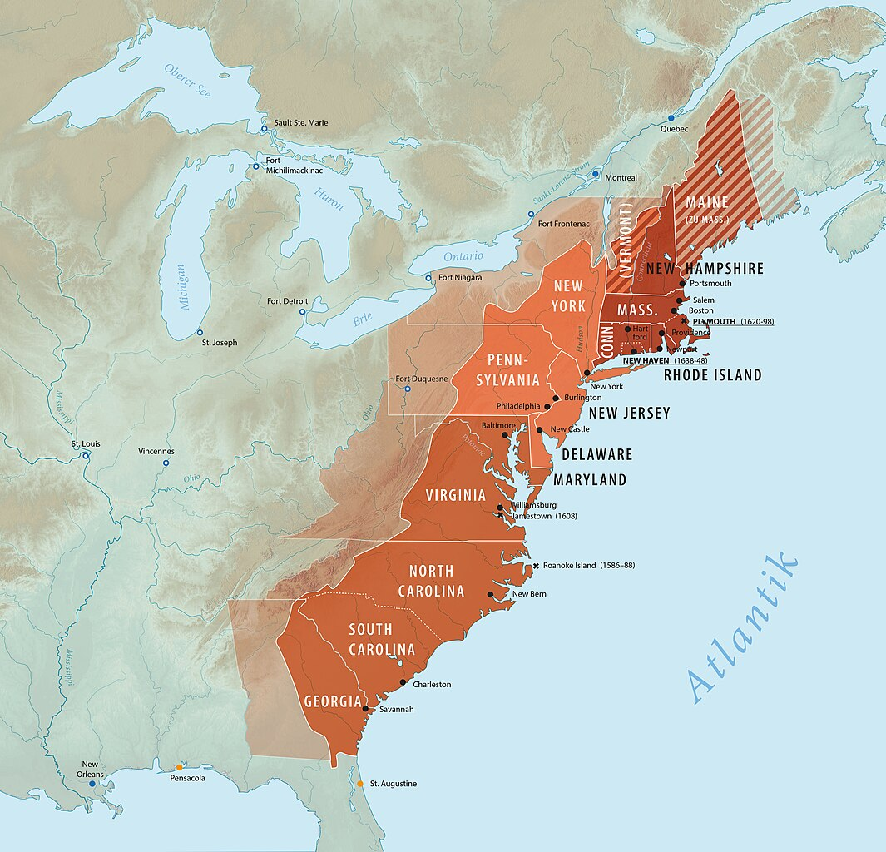
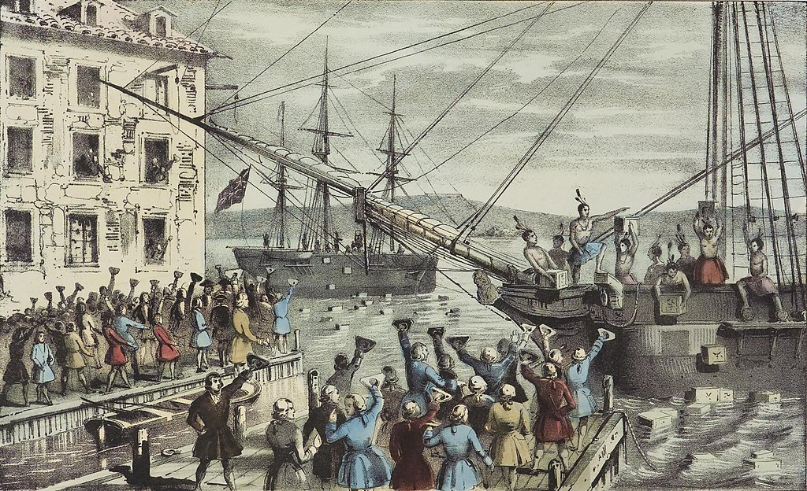
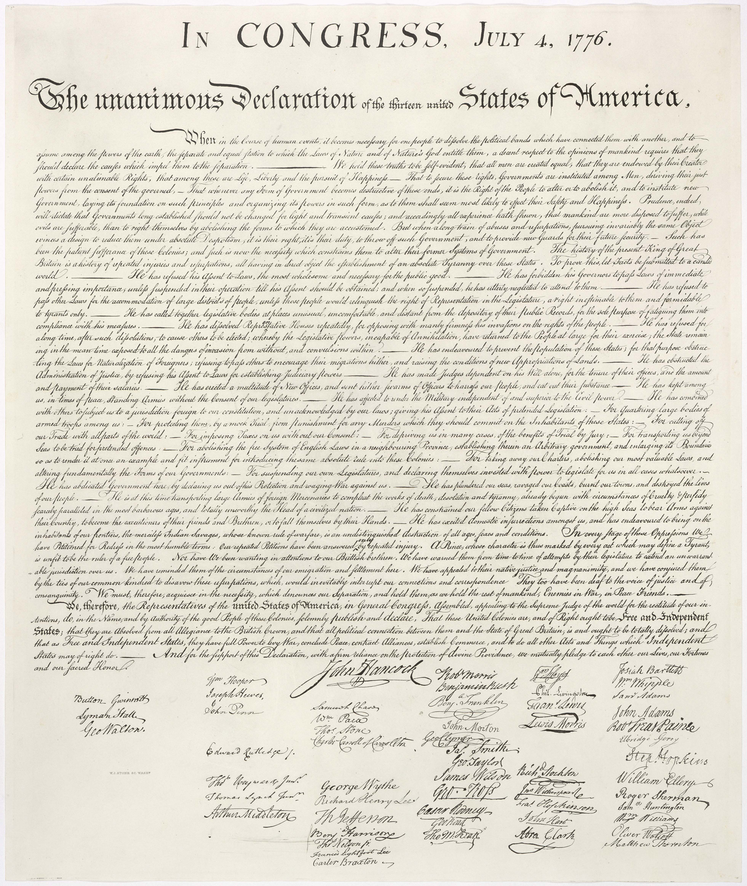

# Conteúdo da Aula 2

> **Arquivo editorial de revisão.** Faça aqui as alterações de conteúdo da aula. Enquanto o campo `status` estiver como `em revisão`, o `index.qmd` não deve ser atualizado. O `index.html` poderá ser criado como prévia de leitura quando solicitado, sem constituir a versão final aprovada.

> **Base desta versão:** material legado de `slides/aula-4/index.qmd`, ementa e calendário de 2026.2. O recorte termina no slide com a imagem da Declaração de Independência dos EUA. O conteúdo iniciado em “Um Asilo para a Liberdade” permanece reservado à Aula 3.

## Slide 1 — Abertura

**Identificação:** CCLHM0081 · História da América Independente

**Título:** Revolução Americana

**Docente:** Eric Brasil

**Data:** 20 de agosto de 2026

**Instituição:** UNILAB

---

## Slide 2 — Acesse os slides da Aula 2

---

## Slide 3 — 1. Colonia de Povoamento X Colonia de Exploração?

- Ibéricos x Anglos-Saxões
- Clima e geografia
- Origens do "atraso" ou "sucesso" das colônias

---

## Slide 4 — 2. Inglaterra no século XVII

- Ausência de um projeto colonial sistemático
    - Tensões entre a Coroa e o Parlamento, entre nobreza e burguesia
    - Tensões religiosas
    - Inflação, fome, peste
    - Aumento da população

---

## Slide 5 — 3. Colonos ingleses na América

- Companhias de comércio: empresas privadas e capitalistas
- Órfãos, mulheres pobres
- Servos por contrato (_indentured servants_)
- Peregrinos (_pilgrims_) e puritanos: perseguição religiosa
- Escravos africanos
- Crescimento populacional

---

## Slide 6 — 13 colônias

---

## Slide 7 — 4. Diferenças regionais

---

## Slide 8 — 4. Diferenças regionais

### Norte {.center}

- Clima temperado
- Policultura
- Consumo interno
- Trabalho familiar
- produção de navios
- comércio triangular
- Pesca / Peles

---

## Slide 9 — 4. Diferenças regionais

### Sul {.center}

- Clima tropical
- Monocultura (tabaco, arroz, algodão)
- Escravidão
- Mercado externo

---

## Slide 10 — 5. Transformações do século XVIII

- Explosão demográfica + movimento populacional + busca por terras
- Governos coloniais perdem controle sobre novos assentamentos
- Grande pressão sobre as populações indígenas
- Maior demanda por grãos na Grã-Bretanha e por alimentos em geral no Caribe = aumenta produção, comércio,
manufaturas, transporte e comunicações.

**Notas docentes:**

Maior atenção por 'racionalizar' o controle imperial sobre esses territórios.

Reservas indígenas = arma para afastar os povos ainda mais para oeste.

Violência nas fronteiras. Grande resistência indígena.

Ocupações a Oeste: longe do controle colonial, sem representatividade nas casas legislativas coloniais.

---

## Slide 11 — 5. Transformações do século XVIII

- Reforma colonial com o final da Guerra dos Sete Anos (1763)
- Reorganização do território adquirido da França e Espanha
- Despesas: gastos, juros, exército, marinha
- Aumento de impostos
- Fim da 'salutar negligência' (_salutary neglect_)

---

## Slide 12 — 6. A resistência dos colonos

- Criação de uma série de leis e impostos que afetavam diretamente a economia das colônias
- Lei do Selo (1765): "ameaça à autonomia colonial"
- Reação: boicote, protestos, motins, violência, jornais, panfletos, clubes
- Filhos de liberdade
- Medidas da coroa pós-1765: tropas, novos tribunais, leis, repressão

---

## Slide 13 — 6. A resistência dos colonos

- Boston Tea Party (1773): reação à Lei do Chá
- Leis coercitivas (1774): fechamento do porto de Boston, intervenção militar

---

## Slide 14 — Nathayel Corrier "Tea sabotage in Boston Port", 1846

---

## Slide 15 — 7. Debate imperial sobre política, representação e autonomia

- O Papel da Representação: No centro do debate imperial estava a questão da "representação virtual," defendida pelos britânicos, que afirmava que o Parlamento representava todos os súditos do Império, mesmo sem representantes eleitos. Os colonos americanos, porém, consideravam essa representação insuficiente e argumentavam que a imposição de impostos sem representação direta era ilegítima, resumindo sua demanda no slogan "no taxation without representation."

---

## Slide 16 — 7. Debate imperial sobre política, representação e autonomia

- Diferenças Ideológicas entre Colonos e Britânicos: Enquanto os britânicos consideravam as reformas e impostos necessários para manter o império, os colonos viam essas medidas como um ataque a seus direitos e liberdades. Essas divergências ampliaram o distanciamento entre colônias e metrópole, dificultando a reconciliação e pavimentando o caminho para a independência.

---

## Slide 17 — Criação de Governos Informais e o Congresso Continental

### **Governos Informais Substituindo o Controle Real**

- **Desintegração do Controle Britânico**
- **Comitês de Correspondência**

**Notas docentes:**

- À medida que a resistência colonial crescia, os governos reais começaram a perder o controle efetivo sobre as colônias. Governos informais, formados por comitês locais e convenções, surgiram para preencher o vácuo de poder.
- Esses comitês desempenharam um papel crucial na coordenação das atividades revolucionárias entre as colônias, criando uma rede de comunicação e ação unificada que desafiava diretamente a autoridade britânica.

---

## Slide 18 — Criação de Governos Informais e o Congresso Continental

### **Formação do Congresso Continental da Filadélfia (1774)**
- **Primeiro Congresso Continental**
- **Declaração de Direitos e Agravos**
- **Organização do Boicote**

**Notas docentes:**

- Convocado em resposta às Leis Intoleráveis, reuniu representantes de todas as colônias, exceto a Geórgia, para discutir uma resposta unificada às políticas britânicas.
- No Congresso, os delegados elaboraram uma declaração que reafirmava os direitos dos colonos enquanto condenava as políticas coercitivas da Grã-Bretanha.
- O Congresso também organizou um boicote aos produtos britânicos, fortalecendo a resistência econômica e política contra a metrópole.

---

## Slide 19 — Novo Tipo de Política Popular e Retórica da Liberdade

### **Emergência de uma Política Popular**
- **Ampliação da Participação Política**
- **Ascensão de Líderes Populares**

**Notas docentes:**

- Com o colapso da autoridade real, houve uma expansão significativa na participação política, permitindo que um número maior de colonos se envolvesse diretamente nos processos políticos. Esta ampliação da arena política levou à formação de uma cultura política mais democrática e participativa.
- Novos líderes emergiram das camadas populares da sociedade, liderando comitês e convenções que assumiram a governança local. Esses líderes muitas vezes utilizavam uma linguagem acessível e apelavam diretamente às massas.

---

## Slide 20 — Novo Tipo de Política Popular e Retórica da Liberdade

### **Retórica da Liberdade**
- **Centralidade da Liberdade no Discurso Político**
- **Impacto da Retórica**

**Notas docentes:**

- A retórica da liberdade tornou-se o tema central nos debates e discursos, servindo como uma poderosa ferramenta de mobilização. Os colonos reivindicavam seus direitos como ingleses e argumentavam que suas liberdades estavam sendo ameaçadas pelas políticas opressivas da Grã-Bretanha.
- A insistência na liberdade não apenas unificou os colonos contra a autoridade britânica, mas também redefiniu o conceito de liberdade em termos mais universais, influenciando movimentos subsequentes de emancipação e direitos civis.

---

## Slide 21 — Novo Tipo de Política Popular e Retórica da Liberdade

### **Ampliação da Arena Política**
- **Inclusão de Novos Grupos**
- **Movimento de Resistência Unificado**

**Notas docentes:**

- A expansão da arena política incluiu não apenas os tradicionais proprietários de terras, mas também artesãos, comerciantes e outros grupos que antes estavam à margem do processo político.
-  Essa ampliação foi crucial para o sucesso da resistência colonial, pois permitiu a formação de um movimento mais unificado e diversificado contra o domínio britânico.

---

## Slide 22 — A Declaração de Independência

### **O Segundo Congresso Continental**
- **Contexto e Função**
- **Decisões Cruciais**

**Notas docentes:**

- Reunido em maio de 1775, o Segundo Congresso Continental funcionou como o governo de fato das colônias, coordenando a resistência contra a Grã-Bretanha e assumindo poderes legislativos e executivos, essenciais para a guerra.
- Sob pressão crescente, o Congresso tomou decisões fundamentais, incluindo a autorização para a criação de um exército e a nomeação de George Washington como seu comandante.

---

## Slide 23 — A Declaração de Independência

### **Ações Militares em Boston**
- **Cerco de Boston**
- **Mobilização Popular**

**Notas docentes:**

- As tensões em Boston culminaram em ações militares significativas, incluindo o cerco de Boston, onde as forças coloniais enfrentaram as tropas britânicas em batalhas iniciais da Guerra de Independência.
- Essas ações demonstraram a crescente mobilização dos colonos em resposta à opressão britânica, sinalizando que a resistência armada seria uma parte crucial do movimento por independência.

---

## Slide 24 — A Declaração de Independência

### **Criação do Exército Continental**
- **Estabelecimento do Exército**
- **Liderança de Washington**

**Notas docentes:**

- O Segundo Congresso Continental criou oficialmente o Exército Continental em junho de 1775, unificando as forças militares das colônias sob um comando central.
- George Washington foi nomeado comandante-em-chefe, escolhendo liderar com um senso de dever e um compromisso com a causa da liberdade, fortalecendo a coesão e moral das tropas.

---

## Slide 25 — A Declaração de Independência

### **Importância da Obra e Ação de Thomas Paine**
- **Publicação de "Common Sense"**
- **Impacto Intelectual e Político**

**Notas docentes:**

- Thomas Paine publicou "Common Sense" em janeiro de 1776, um panfleto que argumentava de forma clara e persuasiva a favor da independência, alcançando um público amplo e galvanizando o apoio popular.
- A obra de Paine teve um impacto profundo, ajudando a transformar o sentimento público em favor da separação definitiva da Grã-Bretanha, tornando-se um dos textos mais influentes da Revolução Americana.

---

## Slide 26 — A Declaração de Independência

### **A Declaração de Independência de 1776**
- **Redação e Influências**
- **Questões de Escravidão**
- **Impacto Democrático**

**Notas docentes:**

- A Declaração foi escrita principalmente por Thomas Jefferson, com contribuições de outros membros do Congresso. Foi fortemente influenciada pelos ideais iluministas, incluindo os direitos naturais e a soberania popular.
- Embora a Declaração proclamasse que "todos os homens são criados iguais", a questão da escravidão foi controversa e comprometida, refletindo as tensões entre os princípios declarados e a realidade social da época.
- A Declaração de Independência marcou um passo decisivo na formação de uma nova nação baseada em princípios democráticos, afirmando a legitimidade do governo baseado no consentimento dos governados e lançando as bases para a luta contínua por direitos e liberdade.

---

## Slide 27 — Declaração de Independência dos EUA, 4 de julho de 1776

---

# Ponto de corte editorial

A Aula 2 termina no slide com a imagem da **Declaração de Independência dos EUA, de 4 de julho de 1776**. O slide seguinte do material legado, **“Um Asilo para a Liberdade”**, e todo o conteúdo posterior permanecem reservados à Aula 3.
