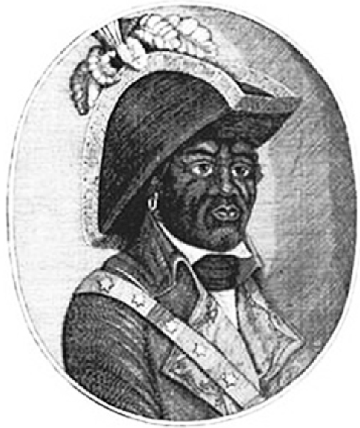
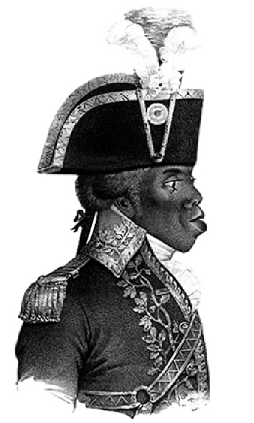
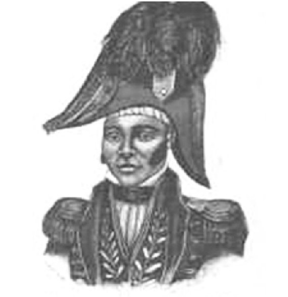

## {.center}

---

## Objetivos da Aula {.center}

- Compreender o processo da Revolução Haitiana (1791–1804)
- Analisar o papel da população negra escravizada na independência
- Discutir os desdobramentos da revolução e a construção da nação haitiana

---

# Parte I — A Revolução de Santo Domingo (1791–1804) {.center}

---

## Por que a Revolução Haitiana importa? {.center}

- **Primeira revolução de escravizados bem-sucedida**: resultou na criação do primeiro Estado negro livre das Américas
- **Impacto global**: desafiou noções de inferioridade racial e influenciou movimentos abolicionistas em todo o mundo
- **Repercussões nas Américas**: provocou medo entre as elites escravocratas, levando à repressão em outras colônias

---

## São Domingos às vésperas da revolução {.center}

- Uma das colônias mais ricas do mundo — açúcar e café
- População majoritariamente composta por escravizados africanos
- Tensões entre colonos brancos, *gens de couleur* (livres de cor) e escravizados
- Circulação dos ideais da Revolução Francesa (1789) entre a elite letrada

---

## Cronologia da Revolução {.center}

| Ano | Evento |
|-----|--------|
| 1789 | Declaração dos Direitos do Homem; repercussões em São Domingos |
| **1791** | **22 de agosto: início da insurreição escrava no norte** |
| 1793–1794 | França aboliu a escravidão nas colônias |
| 1798 | Toussaint Louverture expulsa os britânicos |
---

## Cronologia da Revolução {.center}

| Ano | Evento |
|-----|--------|
| 1801 | Constituição autonomista; Toussaint governador vitalício |
| 1802 | Napoleão envia expedição; Toussaint é capturado |
| **1803** | **18 de novembro: Batalha de Vertières — derrota francesa** |
| **1804** | **1º de janeiro: Independência do Haiti** |

---

## Líderes da Revolução {.center}

### Georges Biassou (?–1801)

{width=30%}

---

## Georges Biassou (?–1801) {.center}

- Líder de comunidade de escravizados fugidos (*marronagem*)
- Um dos primeiros comandantes da insurreição de 1791
- Aliou-se aos espanhóis contra os colonos franceses
- Organizou exércitos e combateu as forças coloniais
- Exilou-se em Cuba após a derrota espanhola; morreu em 1801

---

## Líderes da Revolução {.center}

### Toussaint Louverture (1746–1803)

{width=30%}

---

## Toussaint Louverture (1746–1803) {.center}

- Nasceu escravizado; conquistou a liberdade antes da revolução
- Aliou-se à França após a abolição de 1794
- Unificou a ilha; expulsou espanhóis e britânicos
- Promulgou constituição autonomista (1801): governador vitalício
- Capturado por Napoleão em 1802; morreu preso na França em 1803

---

## Líderes da Revolução {.center}

### Jean-Jacques Dessalines (1758–1806)

{width=30%}

---

## Jean-Jacques Dessalines (1758–1806) {.center}

- General sob o comando de Louverture
- Assumiu a liderança após a captura de Toussaint
- Liderou a derrota final dos franceses na Batalha de Vertières (1803)
- Proclamou a independência do Haiti em 1º de janeiro de 1804
- Proclamou-se Imperador Jacques I
- Assassinado em 1806 por rivais políticos

---

# Parte II — A Construção da Nação Haitiana (1804–1850) {.center}

---

## Aspectos Econômicos {.center}

- **Colapso do sistema plantation**: produção de açúcar e café desabou após a independência
- **Reconfiguração agrária**: pequenas propriedades familiares e agricultura de subsistência substituem as grandes plantações
- **Isolamento internacional**: potências escravocratas boicotaram o Haiti; França exigiu indenização bilionária pelo reconhecimento da independência (1825)

---

## Relações de Trabalho {.center}

- **Fim da escravidão ≠ liberdade plena**: surgimento do sistema de *cultivadores*
- **Código Rural (1826)**: imposição de Boyer — trabalhadores obrigados a permanecer nas plantações
- Condições de trabalho próximas à servidão compulsória
- **Migração para as montanhas**: ex-escravizados criam comunidades autônomas nas áreas rurais

---

## Cidadania e Participação Política {.center}

- Maioria ex-escravizada excluída da participação política efetiva
- Controle do Estado concentrado nas elites crioulas mestiças (*anciens libres*)
- Tensão estrutural entre *anciens libres* e recém-libertados como barreira à cidadania plena

---

## Divisão e Reunificação: Norte e Sul {.center}

- **Tensões internas**: elite mulata e população negra recém-liberta — projetos políticos divergentes
- **Estado no Norte**: Henry Christophe → Rei Henry I (1811) — monarquia autoritária e militarizada
- **Estado no Sul**: Alexandre Pétion → república com reformas agrárias
- **Reunificação (1820)**: Jean-Pierre Boyer unifica o país e anexa a parte oriental da ilha (atual República Dominicana)

---

## Bibliografia {.center}

**Leituras obrigatórias**

- PEREIRA, Bethânia Santos. *Revolução haitiana: a revolução de escravizados que abalou o mundo*. Curitiba: Juruá, 2025. (Coleção História FM). [Cap. 3 e 4]

- FICK, Carolyn. Para uma (re)definição de liberdade: a Revolução no Haiti e os paradigmas de Liberdade e Igualdade. *Estudos Afro-Asiáticos*, v. 26, n. 2, 2004.
